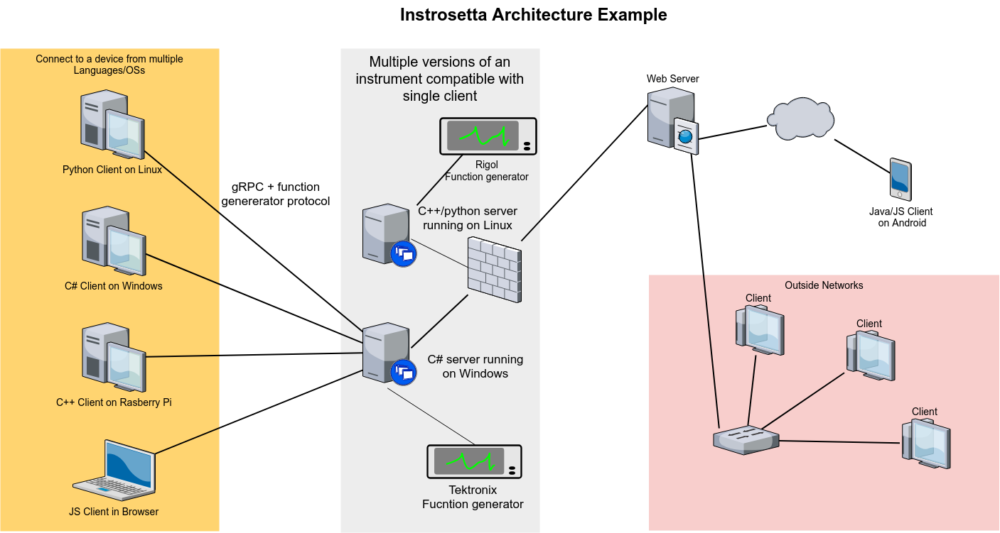

# The Rosetta Stone of instrument control
### Because message passing is, and always will be a great idea.

This repo may be useful to you if:
 - You want to control all your lab instruments from a single script/application but those pesky hardware apis/sdks work best on different languages/OSs and devices are connected to different PCs.
 - You like writing in language X but your lab uses language Y.
 - You love writing device servers but hate writing clients.
 - You love writing device clients but hate writing servers.
 - You may upgrade some equipment soon and dont want to have to rewrite all your control software when that happens.

A collection of communication protocols and implementations for controlling hardware commonly found in the lab.
Based heavily on gRPC, the goal of this project is to allow me (and perhaps you) to write code that can be reused easily by others. This is achieved by seperating low level device control into "servers" and high level device operation to "clients", that communicate in a pre-defined OS/language agnostic way. This allows you to build software using these clients to control your instruments and then seamlessly swap out instruments for new ones without affecting your control software/experiment scripts. Clients and communication protocols should be writtent as general as possible and include no device specific details, all device-specific code should be in the server. This will save you time and heart ache when your device breaks and the newer version has a different sdk. Another huge advantage in using this approach is automated code generation. Define the protocol once and then auto-generate most of the boring parts of the client/server in multiple languages.